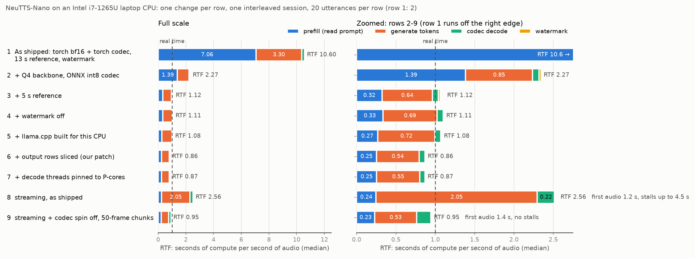
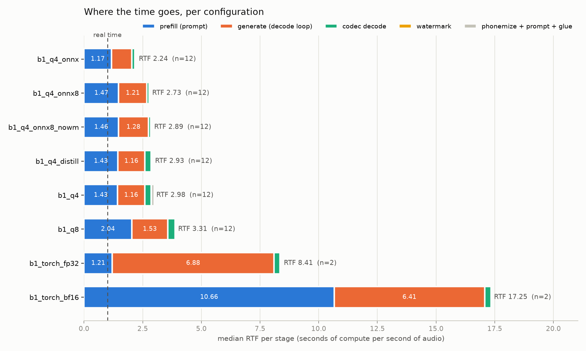
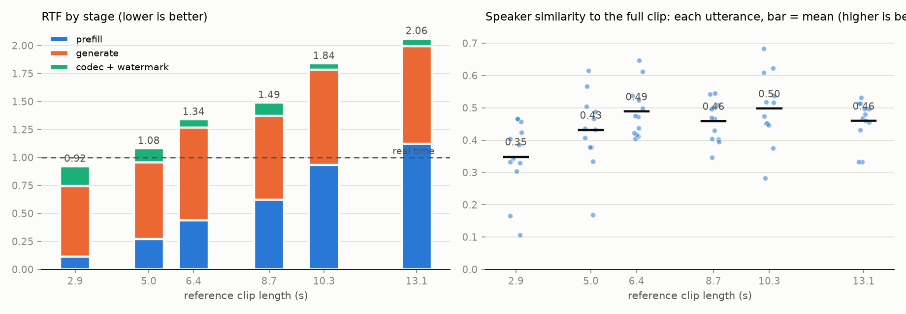
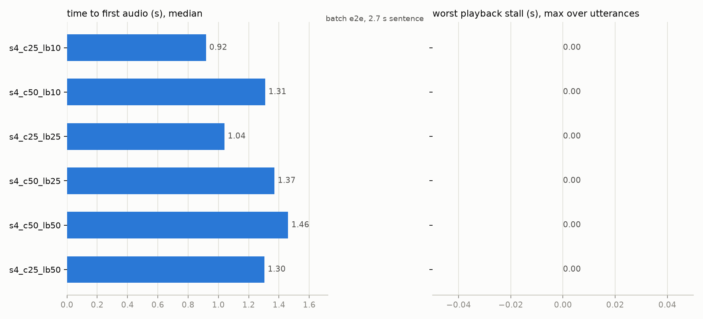
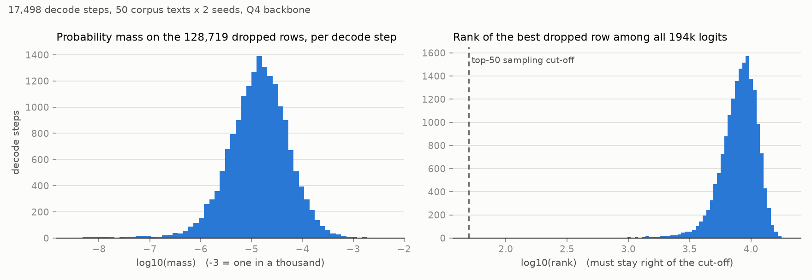
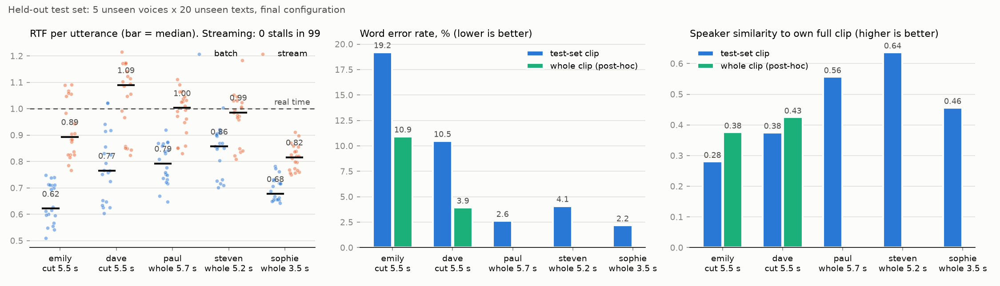

# Design decisions

The reasoning behind each step, in the order it happened, with the figure that settled it. Numbers are in `results/`; commands are in the README.

## Where it ended up

| # | Step added | RTF |
|---|---|---|
| 1 | As shipped: torch bf16 + torch codec, 13 s reference, watermark | 10.6 |
| 2 | Q4 backbone + ONNX int8 codec (Neuphonic's published artefacts) | 2.27 |
| 3 | 5 s reference | 1.12 |
| 4 | watermark off | 1.11 |
| 5 | llama.cpp built for this CPU | 1.08 |
| 6 | output rows sliced (my llama.cpp patch) | **0.87** |
| 7 | decode threads pinned to P-cores | 0.87 |
| 8 | streaming, shipped streaming settings | 2.56, stalls |
| 9 | streaming, codec spinning off, 50-frame chunks | **0.95**, no stalls, first audio 1.4 s |

RTF is seconds of compute per second of audio; below 1.0 is real time. Nothing is retrained; rows 2-7 are identical weights (2.6x), and for row 6 the audio is byte-identical. WER stays at 2-6 % throughout. Three changes do almost all of it: the quantised backbone with the ONNX codec, the shorter reference, and the slice. On five voices I never tuned on, batch measures 0.73 and streaming 0.96 without stalls, with the caveats in the test section.

Caveats on the chain: one voice, one session (identical configs drift up to 25 % between sessions); row 1 is two utterances (earlier runs measured 17); row 8 inherits the pinning, which interacts badly with the codec's spinning threads, so unpinned it measures 1.69; the 1.3 GB RAM figures in `h1_table.md` are a load-time artefact of the `gguf` package, which I had installed for the fork and have since removed, and the footprint is 1.0 GB.

## Deciding what to measure

The machine is an i7-1265U laptop chip, two performance and eight efficiency cores at 15 W, no CUDA. Two early decisions shaped everything:

- **The codec is in scope.** NeuTTS-Nano is a phonemizer, a Llama-style backbone that emits audio tokens, the NeuCodec decoder that turns tokens into a waveform, and a watermark. Neuphonic's published numbers stop at tokens per second. Nobody hears tokens, and the codec is an argument of their own class, so I report backbone tokens/s for comparability and end-to-end RTF as the headline.
- **No weight changes.** Quantisation choice, runtimes, threads, prompts and streaming settings are fair; training is not. Ideas that needed retraining, a lower token rate and a cheaper distilled decoder, were parked.

The metrics follow from that: RTF per stage so I can see where time goes, with an "unaccounted" residual that should stay near zero; peak memory; time to first audio and worst stall for streaming; and two quality floors, Whisper WER and ECAPA speaker similarity, so that no speed trick could pay for itself by dropping words or drifting the voice. Later I added a seam metric for streaming (log-mel distance to the batch waveform of the same seed, because sample-level SNR punishes phase, not audibility) and a count of utterances where the model produced nothing.

## What a trustworthy number costs

The first sweep ran with Spotify, Chrome and Docker open and tokens/s on one sentence fell 4x mid-run. My first instinct, measure the background load and rescale, is wrong on a 15 W part: another process steals clock through the shared power budget, pollutes cache and competes for bandwidth. My second, a gate that discards and re-runs loaded utterances, was also wrong: on an idle machine the "other load" still read 15-20 %, a constant kernel-and-Defender offset with no signal, and it quadrupled run time.

What I settled on is control plus provenance: a preflight that refuses to start above 20 % other-process CPU and names the culprits; per-row recording with a flag, never discarding; high priority and a warm-up; paired seeds, so configurations differ by configuration and not by the dice; and interleaved rounds for anything that matters, so drift hits every configuration equally. The harness wraps Neuphonic's class rather than reimplementing it, so the numbers are for shipped code.

## Step 1: the shipped options

The torch default loads the backbone in bfloat16, which this CPU has no instructions for, so it runs emulated at 40 prefill tokens/s against 314 in float32. The Q4 GGUF backbone and the ONNX int8 codec were the obvious floor: the codec went from 0.27 to 0.10 RTF and 2.8 to 1.0 GB. The watermark is under 0.03 RTF in batch, so it is not a batch lever. The distilled codec changes nothing for speed because its decoder is the same 185.6M-parameter network; only the encoder was distilled, which also killed the idea of exporting it.

## Step 2: the backbone's two phases, and the reference clip

To tune the backbone I split its time into prefill, reading the whole prompt in one pass, and decode, generating one token per pass. Per token prefill is about eight times cheaper, since it pushes hundreds of tokens through each matrix at once; decode has to go one at a time. That split showed the prompt is 940 tokens of which 653 are the 13-second reference clip, re-read from scratch on every utterance. The reference clip is the lever.

I cut the sample voice at word boundaries, with transcripts aligned to Whisper timings, and swept 3 to 13 seconds. RTF is linear in prompt length; 6.4 s matched the full clip on voice similarity, 5 s slipped a little, 3 s was a different-sounding speaker. I took 5 s for headroom and recorded the cost.

Threads turned out small. Prefill likes all twelve threads; decode is best on four pinned to the performance cores, because llama.cpp waits for its slowest thread and an efficiency core is half a performance core. 13 % in isolation became 0-5 % end to end, which I count as noise.

## Step 3: why streaming was slower than batch

As shipped, streaming was 1.6x slower than batch at the default chunk size and stalled for seconds. Three causes, and one wrong hypothesis:

- **The watermark per chunk**, a few hundred milliseconds of fixed cost per call. Off, as a product decision for Neuphonic to revisit.
- **Context re-decode.** The vocoder is bidirectional with global attention, so each chunk re-decodes lookback frames and the result never converges to the batch output (4.2 dB at zero lookback, 2.5 dB at 100, no plateau). Lookback is a quality dial; larger chunks amortise it.
- **Generation itself ran 2x slower in streaming.** I assumed the library's per-token Python path and wrote a token-level loop, verified token-identical to the reference. It gained nothing (it did find a one-frame bug in the shipped tail chunk) and is kept in `experiments/` as the record of a wrong guess.
- **The real cause**: ONNX Runtime's codec workers keep spinning after each call and occupy the cores the backbone needs; a probe showed decode at 35 steps/s after a codec call against 95 steady. One session option, sleep when idle, restored it. Batch never showed it because it calls the codec once per sentence.

With that fixed, chunk size and lookback became a clean trade and I swept both: everything streams without stalling. I chose 50-frame chunks with lookback 50 (seams as shipped, most headroom) and 25 / 10 as a low-latency option (first audio 0.9 s).

## Step 4: the output projection, and forking llama.cpp

Generation was now the largest stage, so I looked at a decode step. The last layer's 576-dimensional vector is multiplied against one row per vocabulary entry, and NeuTTS-Nano kept its text ancestor's 194,256-row vocabulary: that one matrix is as much work as the 24 layers combined, 112M against 117M multiply-adds. But the model only ever emits the 65,536 speech codes and the stop token. Each row's score is an independent dot product, so dropping rows changes nothing for the kept ones; the only risk is a dropped row being sampled, which is measurable.

Over 17,498 decode steps the text rows held a mean of 0.00003 of the probability, never entered the top-50 sampling set, and the closest came 335th. Slicing is a third less work per step with the same candidates, and it also removes a latent failure mode: a sampled text token would be dropped by the decode regex but stay in the model's context.

Doing it from outside failed, instructively: llama.cpp still ran its full projection, and my float32 matrix was 4x the memory traffic of its 8-bit one. So I unzipped a portable compiler, checked out the exact revision the Python bindings vendor, and wrote a 49-line patch: a view of the row range on the quantised matrix, scattered into the full-size score buffer so samplers and bindings are untouched, off by default. Scores identical, tokens identical for a seed (tested on the tuning voice), 40 of 40 WAVs byte-identical, decode 25-28 % faster. A build grid attributed the fork's gain: at default threads the slice is worth 18 % and compiling for this CPU 7 %.

## Step 5: the held-out test

Everything above was tuned on one voice and ten sentences, so the last run was a test set: five unused voices, twenty texts I had not tuned on, once, configuration frozen (the slice measurement had passed those texts through the model on the tuning voice, so they were not entirely unseen). Speed generalised: batch 0.62-0.86 by voice, streaming 0.82-1.09 with zero stalls in 99, long passages included.

Quality did not generalise uniformly. Two voices had 3-7x the word error rate, and they were the two I had cut to five seconds mid-sentence; their whole clips roughly halved the errors but are also longer and run at RTF 0.95 and 1.23. So "under real time on every voice" holds for the clips as tested, and the recommendation is a short clip ending on a natural pause, checked per voice with this harness. The run also produced one failed utterance in a hundred, the model sampling its stop token first; it reproduces on the unmodified library, the shipped code crashes on it in both modes, and the harness now records it.

## What I'd tell the team

Two findings cost nothing and apply everywhere: the output-row slice, a few lines in their own llama.cpp build or export, and the codec's spinning threads, a one-line session option that is the whole reason their streaming mode is slower than their batch mode. Beyond those: the bf16 default is a trap on CPUs without bf16 instructions, and the reference clip length is the biggest lever a user controls.

## Limits and rejected ideas

Samples are small (6-20 texts x 2 seeds) to fit a laptop; the harness scales and only final configurations got the larger runs. Threads and the compiled library are specific to this chip; the slice is verified on Q4, English, top-50 sampling. Rejected: optimising for the playback device (output is PCM); a lower token rate and a trained decoder (retraining, GPU); pinning pipeline stages to separate cores in batch mode (stages are sequential); the load gate; the Python-side projection; llama.cpp batch sizes; and reusing the cached prompt prefix between utterances, which is real but secondary and unmeasured. `docs/PLAN.md` is the original plan, kept as written.
